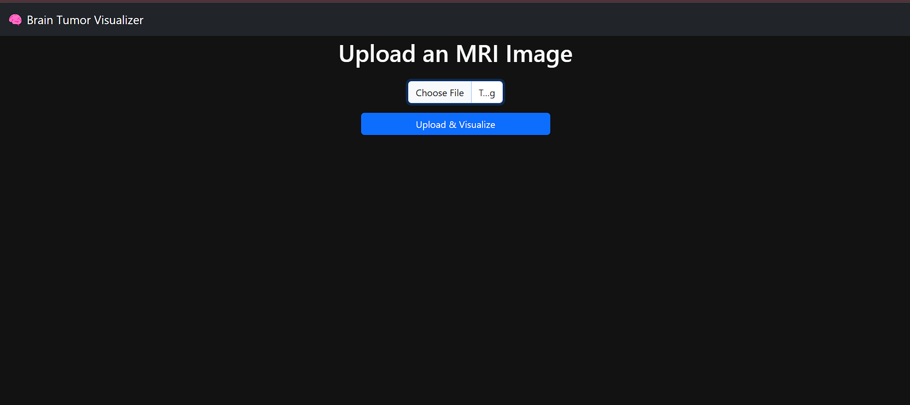
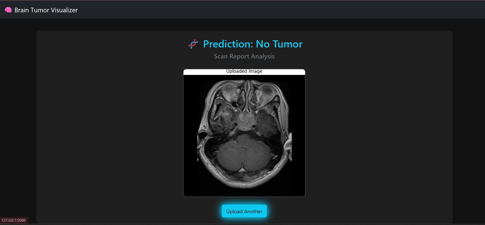

# 🧠 Brain Tumor Classification & Visualizer

A deep learning project that classifies brain MRI images into four categories — **glioma**, **meningioma**, **pituitary**, and **no tumor** — and allows users to **upload and visualize predictions** using a simple web interface.

---

## 🎯 Project Aim

The goal of this project is to assist in the early detection of brain tumors using MRI scans. The system uses a trained CNN model to classify uploaded images and display the prediction to the user through a web app.

---

## 🗂️ Dataset Information

> The dataset is not uploaded here due to size limits.  
> **Please download it from Google Drive:**

📎 [Download Brain Tumor Dataset from Google Drive](https://drive.google.com/drive/folders/1RBdXR8OuY99iuUVMA6xrxWxhJOxVgl2g?usp=drive_link)

To download via terminal or script, use the following command:

```bash
pip install gdown
gdown --folder https://drive.google.com/drive/folders/1RBdXR8OuY99iuUVMA6xrxWxhJOxVgl2g

```
Once downloaded, ensure your folder is structured like this:

```
Brain_tumor_dataset/
├── Training/
│   ├── glioma/
│   ├── meningioma/
│   ├── pituitary/
│   └── notumor/
└── Testing/
    ├── glioma/
    ├── meningioma/
    ├── pituitary/
    └── notumor/
```

---

## 🛠️ Project Structure

```
Brain_tumor_visualizer/
├── Brain_tumor_dataset/
├── brain_tumor_model.h5
├── braintumor.py
├── templates/
│   └── index.html
├── uploads/
├── images/
│   ├── upload_page.png
│   └── result_page.png
├── requirements.txt
```

---

## ⚙️ How It Works

1. **Model Training**  
   A CNN model is trained on MRI images from the 4 classes provided in the training dataset.

2. **Prediction**  
   Users upload an MRI scan through the web UI. The trained model (`brain_tumor_model.h5`) processes it and displays the prediction result.

3. **Web Interface**  
   Built with Flask and HTML, the interface is clean and intuitive for quick diagnosis.

---

## ▶️ Run the Project

1. Install dependencies:
   ```bash
   pip install -r requirements.txt
   ```

2. Run the Flask app:
   ```bash
   python braintumor.py
   ```

3. Open your browser:
   ```
   http://127.0.0.1:5000
   ```

4. Upload an MRI image and get the predicted tumor type instantly.

---

## 📸 Project Preview

### 🔹 Upload Page


### 🔹 Prediction Result


---

## ✨ Thank You for Visiting!

Stay curious, keep learning, and continue building cool projects.  
Made with 💙 and Python.
